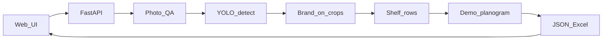

# PoC: розпізнавання полиць (розширене демо)

## Мета демо для замовника
На **5–15 фото** холодильника в **браузері** показати робочий ланцюжок:

1. завантажити фото (або взяти з готових samples);
2. перевірка якості фото (придатне / ні);
3. рамки на знайдених товарах;
4. підпис бренду (не обов’язково exact SKU);
5. грубі ряди полиць;
6. порівняння з **однією демо-схемою** викладки (грубий % збігу);
7. список «мало бути — немає» (по брендах зі схеми);
8. доля полиці по брендах;
9. експорт Excel / JSON.

Це все ще PoC для зустрічі, не прод.

## Що входить / що ні

| В PoC | Не в PoC |
|---|---|
| Простий веб-UI (1–2 екрани) | Повний кабінет, ролі, мульти-тенант |
| Upload + галерея результатів | Мобільний застосунок / офлайн |
| YOLO + бренд-каталог | Exact SKU на весь асортимент |
| 1 демо-схема викладки (JSON) | Сотні планограм по мережах |
| Грубий «товарів немає» по брендах | OOS у глибині полиці |
| Excel з UI | NestJS / Postgres / черги / BI-конектори |
| CLI для батчу samples | LLM на кожне фото |

## Стек
- **Backend:** Python + FastAPI  
- **CV:** Ultralytics YOLO (детект) + CLIP / matching по `catalog/` (бренд)  
- **Frontend:** простий HTML + JS (або мінімальний Vite), без важкого дизайн-системи  
- **Дані:** файли на диску (`samples/`, `out/`), без БД  

TypeScript-прод (NestJS/ONNX) — **після** успішного демо.



## Структура репо
```
Product-shelf-recognition/
  docs/POC-PLAN.md
  README.md
  samples/                 # демо-фото
  catalog/<brand>/*.jpg    # еталони брендів
  planograms/demo.json     # одна схема для шоу
  poc/                     # Python: qa, detect, brand, shelves, planogram, report
  web/                     # UI (static або Vite)
  out/                     # annotated + reports
  requirements.txt
```

## Функціонал по екранах UI

### Екран 1 — Завантаження / демо
- Кнопка upload **або** вибір з `samples/`
- Старт аналізу
- Індикатор прогресу (pending → done / error)

### Екран 2 — Результат одного фото
- Annotated зображення (рамки + бренд + confidence)
- Бейдж: фото придатне / ні (+ причина: blur / темне)
- Лічильники: всього боксів, по брендах, `unknown`
- Ряди полиць (номер ряду → бренди)
- Блок схеми: % грубого збігу; список «очікували / є / немає»
- Кнопки: завантажити Excel, завантажити JSON, наступне фото

### Екран 3 (опційно, якщо встигнемо) — Зведення по батчу
- Таблиця по всіх прогнаних фото
- Сумарна доля брендів
- Експорт спільного Excel

## Демо-схема викладки (`planograms/demo.json`)
Приклад логіки (не слот-в-слот на пікселі):
- очікувані бренди по рядах: `shelf_1: [coca-cola, fanta], ...`
- з фото: бренди, згруповані по Y-рядах
- метрики:
  - **presence:** які expected-бренди взагалі є на фото
  - **row_match (грубо):** чи бренд потрапив на «свій» ряд (±1 ряд — ok)
  - **missing:** expected − detected
  - **share:** % боксів бренду від усіх

Чесно на демо: «це правило для одного типу ХО, не продакшен-планограма».

## День за днем (~4–5 робочих днів)

### День 1 — каркас + детекція
- Структура репо, `requirements.txt`, samples
- YOLO: bbox → annotated JPG + JSON
- Photo QA (blur / brightness → `valid`)
- CLI: `python -m poc.run --input samples/ --output out/`

### День 2 — бренд + ряди
- Каталог 3–8 брендів
- Matching на crops, підписи, `unknown`
- Кластеризація полиць по Y
- Агрегація counts / share

### День 3 — схема + Excel
- `planograms/demo.json`
- Грубий compliance + missing
- `report.xlsx` / `report.json` на фото і на батч

### День 4 — веб-UI
- FastAPI: `POST /analyze`, `GET /samples`, `GET /results/{id}`, `GET /export.xlsx`
- UI: upload / samples → екран результату
- Прогін 5+ фото через UI на зустрічі

### День 5 (буфер) — поліровка демо
- Підкрутити conf / imgsz під шоу-фото
- Talk-track 5 хв, README з командами
- Запасний precomputed `out/` якщо live-інференс повільний

## Критерій «готово до показу»
- З браузера: обрав/завантажив фото → побачив рамки, бренди, схему, missing, Excel
- ≥5 фото проходять без правок коду між ними
- На 2–3 брендах підписи виглядають правдоподібно
- Є демо-схема і зрозуміле пояснення її обмежень
- README: install → `uvicorn` → відкрити UI

## Talk-track на демо (5 хв)
1. Проблема: фото є, звіту немає  
2. Живий прогін 1–2 фото в UI  
3. Що вже є: рамки, бренд, доля, груба схема, missing  
4. Чого немає: exact SKU, багато планограм, мобілка, прод-навантаження  
5. Далі: ваші фото + каталог → оцінка пілота  

## Ризики
- Немає клієнтських фото → samples + чесно сказати  
- YOLO пропускає пляшки → conf/imgsz, не ідеал  
- Плутанина брендів → confidence + `unknown`  
- Live-модель повільна на ноутбуці → precomputed fallback  
- Схема «не як у них» → одна демо-схема як ілюстрація логіки
